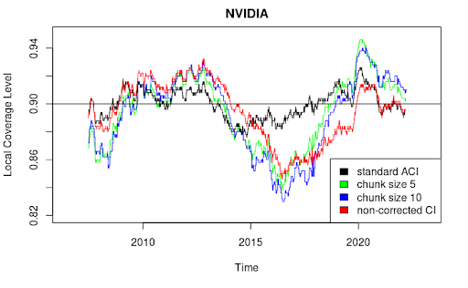
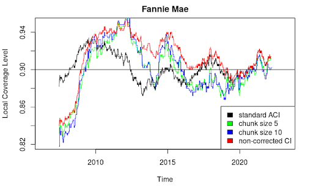
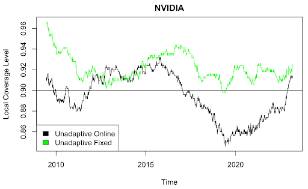
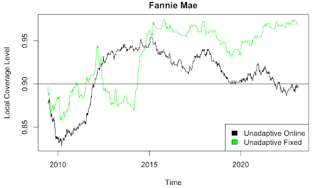
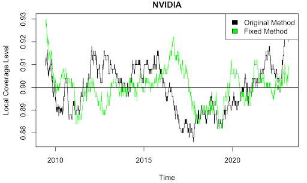
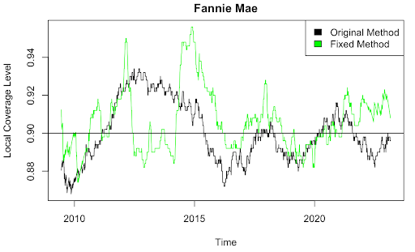
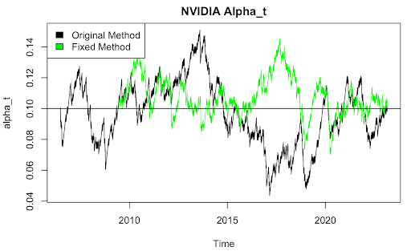

```{r setup, include=FALSE}
knitr::opts_chunk$set(echo = TRUE)
```

# Summary

With the increased application of black box models like machine learning algorithms to high stakes problems, the importance of having tools to quantify the uncertainty of their predictions rises, especially since these models are not explicit in what drives their predictions and where they might go wrong.

One of the most popular tools to address this problem is conformal inference. Conformal inference allows us to measure the predictive power of otherwise non-transparent models by calculating a “conformity score” on model generated predictions and their real data counterparts. However, conformal inference relies quite heavily on exchangeability assumptions, which are often not met in real world applications, in particular settings that are heavily time dependent.

In response, Gibbes and Candès devise a new method: adaptive conformal inference (ACI). ACI works to measure predictive power of models in settings without exchangeability by revealing data increment by increment in  “time steps”, and adjusting the procedure based on the coverage rate in a particular time step.

They show that given a long enough time, ACI meets target coverage without additional assumptions in situations where standard conformal inference fails. Additionally they show that given small distribution assumptions, ACI is robust for most time steps.

The authors test their new procedure on two datasets, election predictions and stock price predictors. In both cases they confirm their theoretical results, ACI maintained approximately 90% coverage while conformal inference failed, often dramatically.

We seek to extend ACI for use on batch data, and test empirically the effects of allowing varying quantile and score functions.

## Intuitive Explanation

The goal of conformal inference is to produce a confidence interval for a new prediction. (The authors’ equivalent formulation: determine if some value y is a “reasonable” estimate.) In essence, we are looking at where some percentage of the most “unusual” predictions have fallen so far, and stating that outside of that interval, the same percentage of future predictions should be similarly unusual. The split conformal inference process is to:
(a) fit some “conformity score” on a subset of the data (“training set”) that characterizes how well each model prediction matches the corresponding actual value,
(b) calculate conformity scores on the rest of the data (“holdout” or “calibration set”),
(c) find the $(1-\alpha)^{th}$ quantile of the calibration conformity scores, and 
(d) infer the prediction interval as the range in which $S(X_{t+1},y)\le \hat Q (1-\alpha)$. 

When new data points are generated from the same process, our quantile will still contain each new point’s conformity score with the same probability. However, if new data points are generated from a different process – a distribution shift – then their conformity scores may be more or less likely to fall within our quantile. This paper suggests that we can account for this fact and maintain the same probability of coverage in the long term by updating our quantile cutoff based on whether or not we cover each new prediction.

The paper suggests making this update by decreasing our quantile by $\gamma\alpha$ if we covered the last prediction or increasing it by $\gamma(1-\alpha)$ if we do not, using some heuristically- or empirically-selected step size $\gamma$. Note that for low alpha, we increase our quantile cutoff much more quickly when we fail to cover than we decrease it when we do cover (for example, for $\alpha = 0.05$, $\gamma(1-0.05) = 0.95\gamma >> \gamma(0.05)$). This makes sense because, with correct $\alpha=0.05$ coverage, we expect to cover 95% of the time and miss 5% of the time – so our adjustments in each direction should be weighted to reflect that a miss is more “surprising” than a cover. 

This “adaptive conformal inference” procedure allows us to ensure that in the long run, we will achieve our targeted coverage frequency. Even in the short run, the local coverage rate will stay relatively close to the target as long as the distribution doesn’t shift too drastically.

# Main Theoretical Results

The authors define their adaptive conformal inference procedure as an online update to the quantile cutoff in the setting in which the true value $Y_t$  is revealed after each prediction $y$. Specifically, the authors point out that there is a value $\alpha^*_t$ such that the miscoverage rate of the prediction set up to $t$ is $\alpha$ when we use $1-\alpha^*_t$ as our quantile cutoff. The authors propose the following procedure to estimate $\alpha^*_t$ at each time step (with the estimate called $\alpha_t$, initialized to $\alpha$ in their experiments): 

$$ \textrm{err}_t := 
\left \{
\begin{array}{ll}
1 & \textrm{if } Y_t \notin \hat{C}_t(\alpha_t), \\
0 & \textrm{otherwise} \\
\end{array} 
\right. 
$$
where 
$$ \hat{C}_t (\alpha_t) := {y : S_t(X_t, y) \le \hat{Q}_t(1 - alpha_t)} $$
Then, fixing a step size parameter $\gamma > 0$ we consider the simple online update
$$ \alpha_{t+1} := \alpha_t + \gamma(\alpha - \textrm{err}_t). $$

Substituting $\textrm{err}_t$ into $1-\alpha_{t+1}$, this procedure sets the $t+1$ quantile cutoff as:
$1-\alpha_{t+1} = 1- (\alpha_t + \gamma(\alpha-1)) = 1 - \alpha_t + \gamma(1-\alpha)$ when we fail to cover and
$1-\alpha_{t+1} = 1- (\alpha_t + \gamma(\alpha-0)) = 1 - \alpha_t - \gamma\alpha$ when we do cover.

A higher step size $\gamma$ makes the method more adaptive to distribution shifts but also can make local coverage more variable; lower $\gamma$ makes the method less adaptive ($\gamma=0$ is equivalent to standard split conformal inference) but moves more towards conditional coverage with respect to time. The authors do not propose a theory-based means of selecting $\gamma$ (they do note that the optimal alpha is proportional to the square root of a quantification of distribution shift, but this is unobserved so is unhelpful in practice). However, they say that $\gamma=0.005$ empirically worked well with their datasets.

The authors also note that the procedure can be easily modified to give some weight to previous coverage/noncoverage events in updating $\alpha_t$, essentially adding some momentum to the update. Specifically:

$$ \alpha_{t + 1} = \alpha_t + \gamma(\alpha - \sum_{s=1}^t w_s \textrm{err}_s) $$

where weights are $\in[0,1]$ and sum to 1. (Obviously, $w_t=1$ is equivalent to the unweighted method.) However, the authors say that though weighting may somewhat smooth local coverage, in their experiments it produces similar results to unweighted updates.

The authors note that this adaptive inference procedure works for any choice of quantile and score functions (assuming those functions are definitionally valid, e.g. the quantile function must be nondecreasing). However, they also acknowledge that the procedure’s performance is sensitive to quality of conformity scores. In particular, the closer to stationary the conformity score (despite shifts in the data distribution), the closer the procedure will stay to target coverage. 

The authors prove two main performance guarantees for the procedure. First, they show that over a long time interval, adaptive conformal inference converges on the targeted coverage frequency without any distributional assumptions:

$$ \lim_{T \to \infty} \frac{1}{T} \sum_{t=1}^T \textrm{err}_t \stackrel{a.s.}{=} \alpha.$$

Then, they show that for a sufficiently small distribution shift (and appropriate initialization of $\alpha_1$), the marginal coverage rate will stay close to 1-$\alpha$ in expectation. Specifically, the authors prove this result in the case in which the data originates from distributions associated with the states of a hidden Markov chain with a stationary distribution. The authors acknowledge that this model may not directly apply to the real world, but argue that the results are a good approximation of the procedure’s behavior in many real-world settings. 

(To analyze this claim a bit: Two cases in which this model would not be applicable are when the data distribution shifts seasonally or with a continual trend, as the corresponding Markov process would be periodic or contain infinite transient states, respectively, and so would have no stationary distribution. But note that these cases are where the data distribution has a trend or is seasonal; trend or seasonality in $X$ and $y$ is fine as long as their joint distribution remains the same. Also, predictable distribution shift could be handled in the long run by adding a time variable to $X$. A more problematic case is that of the infinite null recurrent Markov chain, eg a number line random walk.) 

This second performance guarantee also requires a few other assumptions: that an initialization period has passed such that the Markov process has reached its stationary distribution, and that the quantile and score functions are fixed in time. The latter assumption is potentially rather limiting as this is not how the procedure would typically be implemented; in practice we would want to retrain the functions as we get additional data.

The actual result shown by the authors is the following:


$$ E[(M(\alpha_t | A_t) - \alpha)^2 ] \le \frac{L(1 + \gamma)}{\gamma} E [ | \alpha_{A_{t+1}}^* -\alpha_{A_t}^* | ] + \frac{L}{2} \gamma $$ 

where $M$ is the realized miscoverage rate, $A$ indicates the hidden state of the underlying Markov model, and $L$ is a positive constant such that \[ | M(\alpha_2 | a) - M(\alpha_1 | b) | \le L | \alpha_2 - \alpha_1 | \] for any $\alpha_1,\alpha_2$ and any Markov state $a$ in the chain. (The authors also prove an intermediate result showing that the miscoverage rate’s distance from $\alpha$ is bounded over sufficiently long time periods.) The left-hand side of the inequality result is the expected Euclidean distance between marginal misclassification rate and $\alpha$. Since $\gamma$ is typically small, the right-hand-side of the inequality will be small, bounding the misclassification rate near $\alpha$. The right-hand-side expectation quantifies the distribution shift, showing that the distance between marginal coverage and alpha is bounded more tightly when the distribution shift is small.

# Limitations

Gibbs and Candès point out three limitations with their method. First, their method is devised with the assumption that data is revealed in an online manner: the true value of each time step is revealed before prediction of the next time step. While this assumption is met in some cases (like stock market data), there are many settings in which data is received in batches. On top of making it hard to evaluate settings where data is irregular over time, it prevents the evaluation scheme from distinguishing between “bad” prediction subsets and “good” ones merely by conditioning on time.

Another limitation of the more strict theoretical performance result is that they assume a fixed quantile function, $\hat{Q}(\cdot)$, predetermined without influence from new data. Gibbs and Candès prove that fitting $\hat{Q}_t(\cdot)$ in an online fashion to the most recent data similar to $\alpha_t$ will provide correct coverage given sufficiently large time intervals. However, the proof of short term bounds given good initialization of $\alpha_1$ relies on a fixed $\hat{Q}(\cdot)$, limiting the theoretical performance of the fully online method. The online method was used in their following experiments, showing that it does have practical success. We further investigate this discrepancy below.

A third limitation of the procedure is that they specify no theoretical guidelines for choosing an effective $\gamma$. A proper choice of time step for the data is extremely important, as too large values of $\gamma$ induce volatility in the coverage produced at each step $\alpha_t$. This will cause the procedure to heavily penalize predictive power in particular time steps and reward it in others, which could be undesirable in cases where the underlying model has some degree of robustness over time. In their experiments they settle on a choice of $\gamma = 0.005$, but acknowledge that this has no guarantee of success in other applications.

A limitation not mentioned by the authors comes from common procedures to reduce the computational complexity of conformal inference methods. One such procedure is to limit the calculation of the prediction set to the interval observed in the data. In standard conformal inference, this simplification is guaranteed to not adjust the coverage by much for large $n$, as:

$$ \hat{C}'(X_{n+1}) = \hat{C}(X_{n+1}) \cap \textrm{range}_{ 1 \le i \le n} (Y_i) $$
$$ P(Y_{n+1} \in \hat{C}'(X_{n+1}) ) \ge P(Y_{n+1} \in \hat{C}'(X_{n+1}) - P(Y_{n+1} \notin \textrm{range}_{ 1 \le i \le n} (Y_i)  \ge 1 - \alpha - \frac{2}{n + 1} \textrm{ by exchangeability } $$

But since 

1. ACI does not assume exchangeability for all $(Y_1, … , Y_{n+1})$, and
2. ACI calculates $\hat{C}_t (\cdot)$ in an online fashion, making the bound dependent on time even if exchangeability was met

ACI may not be able to make a similar time saving procedure, hampering practical performance unless some assumptions are conceded. 

# Extension: Batched Procedure

As pointed out previously, one limitation of the procedure is that it is unable to handle data received in delayed batches, and may mistreat data in cases without data collectable on uniform time increments. 

An intuitive extension to ACI that may work better in these cases is a procedure that updates $\alpha$ based on coverage rate in chunks (either defined by intervals of discrete time or regularly spaced batches of data). Consider the following procedure:	

Given data $(X_{s_i}, Y_{s_i})$ in discrete chunks enumerated $(X_s, Y_s)$. Assume for each data point $s_i$ we are given a fitted score function $S_{s_i}(\cdot)$ and a corresponding quantile function $\hat{Q}_{s_i}(\cdot)$. Then, in similar fashion to the old procedure define the realized miscoverage rate of the prediction set $\hat{C}_{s_i}(\alpha_s) := \{ y : S_{s_i}(X_{s_i}, y) \le \hat{Q}_{s_i}(1-\alpha_s) \}$ as 

$$ M_s(\alpha_s) := P(S_s(X_s, Y_s) > \hat{Q}_s(1-\alpha_s)). $$

Define the sequence $\alpha_s$ given a target $\alpha$, fixing a step size parameters $\gamma > 0$ as:

$$ \alpha_{s+1} := \alpha_s + \gamma(\alpha - \textrm{err}_s). $$
for $\textrm{err}_s$:
$$ \textrm{err}_s := \frac{1}{\textrm{\# i in s}}\sum_{i \in s}
\mathbb{1} \{ Y_{s_i} \notin \hat{C}_{s_i}(\alpha_s)\}
$$

Intuitively what we are doing is rather than adjusting the value of $\alpha$ for every data point $s_i$, we are adjusting it per chunk of data $s$ by the rate of coverage in that chunk.

## Long term coverage for modified procedure

Following similar steps to the proof outlined for the standard ACI, we can get some long term coverage guarantee for our modified procedure. We will similarly assume that with probability one $\alpha_1 \in [0, 1]$ and $\hat{Q}_{s_i}(\cdot)$ is non decreasing and is $\infty$ for inputs greater than one and $-\infty$ for inputs less than zero.

**Lemma 4.1 adjusted**: with probability one we have that $\forall s \in \mathbb{N}, \alpha_s \in [-\gamma, 1+\gamma]$.

*Proof*: assume towards a contradiction that with positive probability $\{\alpha_s\}_{s \in \mathbb{N}}$ is such that $\inf_s \alpha_s < -\gamma$ (the case where $\inf_s \alpha_s > 1 + \gamma$ is identical). Note that $\sup_s |\alpha_{s+1} − \alpha_s| = \sup_s \gamma | \alpha − \textrm{err}_s| < \gamma$. Thus, with positive probability we may find $s \in \mathbb{N}$ such that $\alpha_s < 0$ and $\alpha_{s + 1} < \alpha_s$. However,

$$ \alpha_s < 0 \implies \hat{Q}_{s_i} (1 - \alpha_s) \forall i \in s \implies \textrm{err}_s = 0 \implies \alpha_{s+1} = \alpha_s + \gamma(\alpha - \textrm{err}_s) \ge \alpha_s $$

and thus $P(\exists s \textrm{ such that } \alpha_{s+1} < \alpha_s < 0) = 0$, which is a contradiction.

**Proposition 4.1 adjusted**: with probability one we have that $\forall S \in \mathbb{N}$,

$$ | \frac{1}{S} \sum_{s=1}^S \textrm{err}_s - \alpha | \le \frac{\max \{ \alpha_1, 1- \alpha_1 \} + \gamma}{S \gamma} $$

which implies

$$ \lim_{S \to \infty} \frac{1}{S} \sum_{s=1}^S \textrm{err}_s \stackrel{a.s.}{=} \alpha $$

*Proof*: expanding the recursion for $\alpha_s$ and applying lemma 4.1 adjusted in the same way as for the original method yields the result, since the recursion for $\alpha_s$ and $\alpha_t$ share the same structure. 

Thus our modified procedure has a similar agnostic guarantee of correct long-term coverage frequency as standard ACI.

## Modified procedure in practice

To get a quick comparison between the standard method and the modified one we ran the modified procedure on the same data set as those run for the standard procedure (NVIDIA and Fannie Mae stock data), with a target coverage level of 90%. To do this, we simply grouped the otherwise perfectly distributed data into specified chunk sizes for our two runs of the modified procedure. For some details on the author's code, see the caveat in the next section.

{width="50%"}
{width="50%"}


We do see less robustness with changes to time than standard ACI, but this is to be expected, as we have less effective time to converge to good values of alpha, and less points in time to adjust to shifts in the underlying distribution. Worryingly, the NVIDIA data between the years of 2015 and 2017 the procedure seems to achieve dramatically worse coverage than either standard ACI or standard CI. While this perhaps is not as much of an issue as it seems in this example (Gibbs and Candès too had time increments where ACI failed), it is worth pointing out the potential pitfalls of such a modification. All in all, the modified procedure seems to trade away most of the advantages of standard ACI, but could still be applicable in settings with certain data constraints.

# Experiment: How Applicable is the Fixed-QS Setting?

Intuitively, we might expect varying-$QS$ to perform better than fixed-$QS$ in a distribution-shifting setting, both because this provides a larger amount of training/calibration data and because it essentially adjusts $S$ and $Q$ in addition to $\alpha_t$ in response to distribution shift. On the other hand, it is possible that the approach used by the authors in their experiments –  refitting $S$ and $Q$ on the previous `lookback` data points at each time step (they use `lookback=1250` in their stock analysis) – is subject to overfitting issues due to the reuse of the same data for score training and quantile calibration. 

As the authors allude to, it’s difficult to obtain analytical results for varying-$QS$ performance. So, we used the same stock-volatility example as the authors to explore the differences in results between fixed-$QS$ and varying-$QS$ approaches. 

Specifically, we replicate the authors’ experimental results shown in Figure 1 for NVIDIA and Fannie Mae, then repeat the same analysis but using $S(\cdot)$ trained on the first 1250 data points and $Q(\cdot)$ calibrated on the subsequent 1250 data points. We compare ACI local coverage rate, ACI $\alpha_t$ values, and fixed-$\alpha$ local coverage rate for each $QS$ approach.

A quick caveat: While the authors provide some R code to replicate Figure 1, there are a few minor details about their implementation that are unclear from the code or the paper. Specifically, it is unclear if their starting $t=1$ is the first day of 2005, or 1250 days before that (their initial training/calibration period), and it’s not specified how they handle the calculation of local coverage within 250 time steps of the edges of their predictions. We chose to take $t=1$ as 1250 days before 2005 (ie July 2, 2001) and padded errors with NaNs. Based on these choices, our results may differ slightly from the authors’, but an inspection of our local coverage plots confirms that we largely replicate their output for both NVIDIA and Fannie Mae. (Note: Our for-comparison Bernoulli sequence does differ from the authors’ for obvious reasons.)

Using a non-adaptive approach (ie fixed $\alpha$), varying-$QS$ (“unadaptive online”) seems to clearly outperform fixed-$QS$ (“unadaptive fixed”). This supports the idea that re-training $Q$ and $S$ on recent data points partially accounts for distribution shift (and in this case, that effect outweighs possible overfitting effects). 

{width="50%"}
{width="50%"}

Moving to ACI, varying-$QS$ (“original method”) performs similarly to fixed-$QS$ (“fixed method”) for the NVIDIA dataset, but shows significantly more variability in local coverage for Fannie Mae. This is related to the fact that Fannie Mae’s fixed-$QS$ $\alpha_t$ is much more variable than its varying-$QS$ $\alpha_t$. An interesting situation arises for Fannie Mae post-2015: $\alpha_t$ is significantly elevated in the fixed-$QS$ method, but local coverage is similar for both methods. Both of these observations again point to the fact that varying $Q$ and $S$ dampen the need for variation in $\alpha_t$, allowing $\alpha_t$ to remain near $\alpha$ over time with variation to help account for rapid shifts.


{width="50%"}
{width="50%"}
{width="50%"}
{width="50%"}

Of course, this experiment’s external validity is very limited: it’s possible that differences we observe are unique to these datasets. Still, these results do support the intuition that the performance guarantee for ACI under fixed-$QS$ would hold under varying-$QS$. On the other hand, they don’t provide any strong evidence for better performance. One hypothesis emerging from this experiment is that the local performance guarantee proof’s setting (a smaller distribution shift with fixed-$QS$) may be equivalent to a larger-distribution-shift setting with varying-$QS$ for the purposes of the proof, since retraining $Q$ and $S$  dampens the effective distribution shift faced by $\alpha_t$.

# Possible Other Extensions

We mention here but do not implement a number of other possible extensions to the paper:

* It would be useful to experiment, possibly via simulation, with the method’s performance under different forms of nonstationarity. Similar to the fixed-$QS$ analysis above, this could provide support for or against the broader applicability of the local performance guarantee.
* The weighted method proposed by the authors could be better analyzed, both theoretically and over a broad range of weights (extending to uniform weights). The authors say that they found it to be similar in performance to the unweighted method, but only mention testing it with a quite rapid decrease in weight going back in time. 
* On a related note, it would be valuable to evaluate other methods of adding momentum to $\alpha_t$ updates. For example, if we have missed coverage quite a few times recently, we guess that we are in the midst of a distribution shift and so accelerate quantile widening by even more. Specifically, we could apply momentum implementations similar to those often used in gradient descent. This would make sense in light of the online-learning view of the $\alpha_t$ updates (although, unlike in many other gradient-descent settings, $\alpha_t$ optimization must be convex). The weighting proposed by the authors achieves this to a significant degree (in fact, they call the weighting “momentum” in their code!) but is not directly equivalent to several other momentum approaches.
* The authors apply ACI to prediction of the next time step, but it could be extended in a straightforward manner to prediction intervals for longer forecast horizons, which would be updated each time step as well.
* Finally, it would be interesting to explore the use of ACI in a setting where the prediction model is moving between different environments (as opposed to the environment changing over time). 
